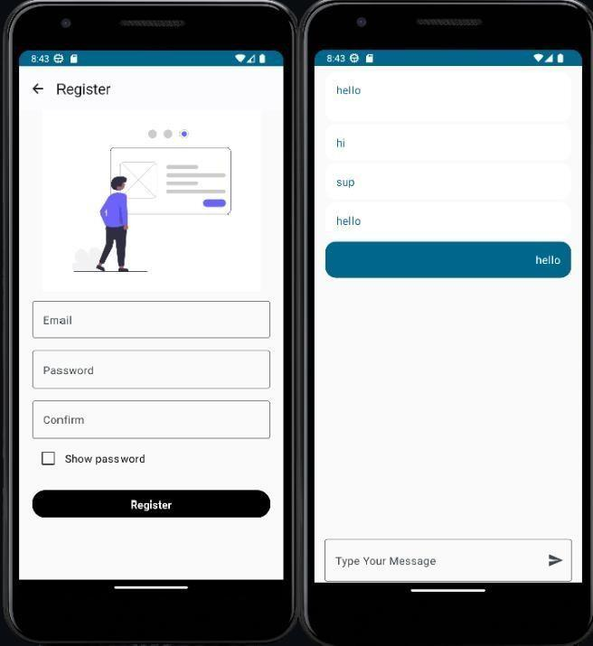

# ChatApp

A simple **real-time chat application** built in Kotlin.  
It allows multiple users to send and receive messages instantly.

## Features
- Real-time messaging
- Lightweight and fast
- Easy to run and use

## Screenshot

